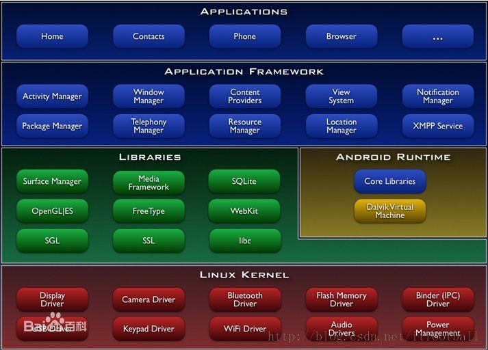

# android FrameWork  学习

 * 安卓分层:
     > Linux2.6 核心层
     > 核心库层
     > 应用框架层
     > 应用层
      

## Framework可以理解为一些可供调用的API 通过接口可供上层接口调用Framework层向上提供可供上层应用调用的接口,向下连接c/c++ 这样可以使开发者更加的关注上层,不必关心底层怎么实现

       >ActivityManger 用来管理程序的生命周期,并且提供常用的导航回退功能
       >WindowManager 提供一些访问手机屏幕的方法,比如手机屏幕的透明度,亮度,背景等
       >ContentProviders 是的应用程序可以去访问另一个应用程序的数据库,或者共享他们自己的数据
       >NotificationMagager 是应用程序可以在状态栏当中显示自定义的提示信息
       >packageManager 提供系统的安装包服务,包括安装卸载应用,查询permission信息等
       >TelephonyManager 主要提供了一系列访问手机通讯录的状态和信息的方法,查询电信网络的状态信息,sim卡的信息
       >ResourceManger 提供非代码资源的访问,比如本地字符串,图形,和布局文件
       >LocationManager 提供设备位置的获取方式,
       >Xmpp 可扩展通讯和表示协议,提供即时通讯服务
       >..........

### ActivityManager 学习
 

